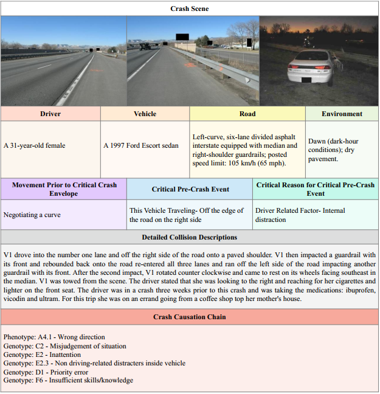
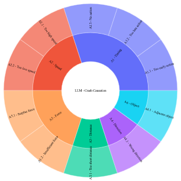
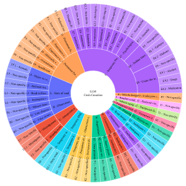

# Road-Crash-Causation-Chain Dataset

This repository provides the Road-Crash-Causation-Chain dataset, a manually reviewed dataset for case-specific crash causation-chain inference. The dataset is built from in-depth crash investigation records and uses the Driving Reliability and Error Analysis Method (DREAM) to represent crash causation chains in a standardized code-label format.

The dataset accompanies the paper:

> Leveraging large language models for crash causation chain inference with in-depth accident investigation data  
> Transportation Research Part C: Emerging Technologies, 191, 105820  
> https://doi.org/10.1016/j.trc.2026.105820

## Dataset Summary

| Item | Description |
| --- | --- |
| Number of cases | 4,000 |
| Data source | National Motor Vehicle Crash Causation Survey (NMVCCS) |
| Task | Generate a structured DREAM causation chain from in-depth crash investigation data |
| Train/validation split | 3,200 training cases and 800 validation cases |
| Sample IDs | `case_000001`, `case_000002`, ... |

The sample IDs are stable across the raw reports, causation-chain labels, and train/validation splits.

## Repository Contents

```text
data/
  raw_reports/          # 4,000 crash investigation inputs
  causation_chains/     # 4,000 corresponding DREAM causation-chain labels
  train.json            # LLaMA-Factory-style SFT training data
  val.json              # LLaMA-Factory-style SFT validation data
  splits/
    train_ids.txt
    val_ids.txt

scripts/
  build_sft_dataset.py  # Build SFT data from paired input/output text files
  run_inference.py      # Run inference with a base model and optional LoRA adapter
  evaluate.py           # Compute Vehicle-node F1 and ROUGE metrics
  train_lora_example.yaml

figure/
  example.png
  Phenotype.png
  Genotype.png
```

## Data Organization

Each file in `data/raw_reports/` contains the crash investigation input used for causation-chain inference. Each file in `data/causation_chains/` contains the corresponding DREAM causation-chain annotation.

Example DREAM causation-chain label:

```text
Vehicle 1 (V1)
Phenotype: A1.3 - No action
Genotype: C2 - Misjudgement of situation
Genotype: E2 - Inattention
Genotype: E2.3 - Non driving-related distracters inside vehicle
```

The SFT files `data/train.json` and `data/val.json` use a chat-style format:

```json
{
  "id": "case_000001",
  "vehicle_count": 2,
  "messages": [
    {"role": "system", "content": "..."},
    {"role": "user", "content": "..."},
    {"role": "assistant", "content": "Vehicle 1 (V1)\\n..."}
  ]
}
```

## Quick Start

The released `train.json` and `val.json` files are already provided. The evaluation script uses only the Python standard library. Model inference requires PyTorch, Transformers, and PEFT when a LoRA adapter is used.

Install optional inference dependencies:

```bash
pip install -r requirements.txt
```

### Build SFT Data

To rebuild an SFT file from paired text files:

```bash
python scripts/build_sft_dataset.py \
  --input-dir data/raw_reports \
  --output-dir data/causation_chains \
  --train-out data/train_rebuilt.jsonl \
  --val-out data/val_rebuilt.jsonl \
  --val-ratio 0.2 \
  --seed 42
```

### Run Inference

```bash
python scripts/run_inference.py \
  --base-model Qwen/Qwen3-14B \
  --adapter outputs/crashcausation_qwen14b_lora \
  --dataset data/val.json \
  --output outputs/val_predictions.json
```

### Evaluate Predictions

```bash
python scripts/evaluate.py \
  --reference data/val.json \
  --predictions outputs/val_predictions.json \
  --save-details outputs/val_eval_details.json
```

The evaluation script reports Vehicle-node Precision, Vehicle-node Recall, Vehicle-node F1, ROUGE-1, ROUGE-2, and ROUGE-L.

## Dataset Visualization

<p align="center">
  
  <br>
  Case example
</p>

<p align="center">
  
  
</p>

<p align="center">Phenotype and genotype distributions in the Road-Crash-Causation-Chain dataset</p>

## Annotation Notes and Feedback

The DREAM framework may allow reasonable alternative coding paths in some cases. For example, the same crash can sometimes be represented from the perspective of an action-level phenotype, or alternatively from an observation- or cognition-level phenotype. Therefore, some annotations may differ from a user's preferred coding path while still following the DREAM rules and being supported by the crash report.

If you identify a potentially incorrect, ambiguous, or disputable annotation, please contact the authors or open an issue in this repository. We will continue to review feedback and maintain updated versions of the dataset when necessary.

## Citation

If you use this dataset, please cite the associated paper:

```bibtex
@article{dai2026crashcausation,
  title   = {Leveraging large language models for crash causation chain inference with in-depth accident investigation data},
  author  = {Dai, Bingyou and Wang, Xuesong and Yang, Fengchun and Feng, Yuxiang and Wang, Yinhai and Quddus, Mohammed},
  journal = {Transportation Research Part C: Emerging Technologies},
  volume  = {191},
  pages   = {105820},
  year    = {2026},
  issn    = {0968-090X},
  doi     = {10.1016/j.trc.2026.105820},
  url     = {https://www.sciencedirect.com/science/article/pii/S0968090X26003086}
}
```

## License

The software code in this repository is released under the MIT License. See `LICENSE` for details.

The dataset is released for non-commercial research and educational use. See `DATA_LICENSE.md` for the dataset terms.
